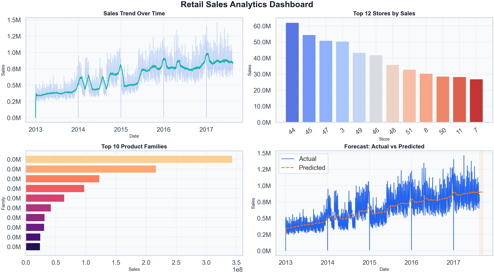

# 📊 Sales Analytics & Forecasting Model


## 🚀 Overview
This project delivers an end-to-end retail analytics pipeline using the Kaggle Store Sales dataset to transform raw transactional records into business-ready insights and forecasts. It helps decision-makers understand historical revenue behavior, identify high-impact stores and product families, and estimate future sales trends for planning. The workflow is designed to mirror real-world analytics delivery with clean code, modular ETL, visual storytelling, and actionable recommendations.

## 🎯 Business Problem
Retail organizations need dependable forecasting and performance analytics to make smarter operational and strategic decisions.

- Why forecasting matters:
  - Improves inventory planning and reduces stockouts/overstock risk.
  - Supports staffing and promotion timing around expected demand.
  - Enables earlier intervention when sales trajectories weaken.
- What decisions this supports:
  - Which stores should receive priority investment.
  - Which product categories should be promoted or optimized.
  - How monthly and daily sales trends should inform commercial planning.

## 📂 Dataset
Source: Kaggle Store Sales - Time Series Forecasting

The project integrates multiple relational tables:
- `train.csv`: historical daily sales and promotions
- `stores.csv`: store metadata (city, type, cluster)
- `transactions.csv`: daily store-level transactions
- `oil.csv`: external macro signal (oil price)
- `holidays_events.csv`: holiday/event context

## 🔍 Workflow
1. Data cleaning  
2. Feature engineering  
3. Data merging  
4. Analysis  
5. Forecasting

## 📊 Dashboard Preview


## 📈 Key Insights
- Revenue trends over time:
  - Sales show long-term growth with visible seasonality and periodic volatility.
- High-performing stores:
  - A subset of stores contributes a disproportionate share of total sales.
- Sales patterns:
  - Product family performance is highly concentrated, with top families driving most revenue.

## 🔮 Forecasting
Forecasting combines two complementary methods:
- Linear Regression: captures long-term trend.
- Rolling Average: captures short-term local behavior.

The final prediction is a blended estimate across both signals for better practical stability.

Why this is useful:
- Provides a transparent, explainable baseline forecast.
- Easy to communicate to business stakeholders.
- Serves as a strong benchmark before advanced models (Prophet, XGBoost, ARIMA).

## 💡 Business Recommendations
- Where to invest:
  - Prioritize high-performing stores with proven sales velocity.
- What to optimize:
  - Improve assortment and promotions in underperforming product families.
- How to improve sales:
  - Align inventory and campaigns with forecasted peaks and seasonality windows.

## ⚙️ Tech Stack
- Python
- SQL
- Power BI
- Pandas
- Matplotlib
- Seaborn
- Scikit-learn

## 📂 Project Structure
```text
Sales_Analytics_&_Forecasting_Model/
├── data/
│   ├── raw/                   # Source Kaggle files (ignored in git)
│   └── processed/             # Cleaned data outputs
├── notebooks/                 # Optional exploratory notebooks
├── outputs/
│   ├── charts/                # Individual visualization files
│   └── dashboard/             # Combined dashboard image
├── scripts/
│   └── retail_analysis.py     # Main production-style analytics pipeline
├── sql/
│   └── queries.sql            # Reusable analysis SQL queries
├── requirements.txt
└── README.md
```

## ▶️ How To Run
```bash
python scripts/retail_analysis.py
```

Generated artifacts:
- `data/processed/cleaned_retail_data.csv`
- `outputs/forecast_actual_vs_predicted.csv`
- `outputs/charts/*.png`
- `outputs/dashboard/dashboard.png`
